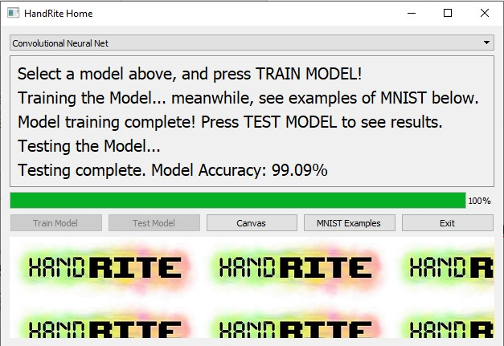
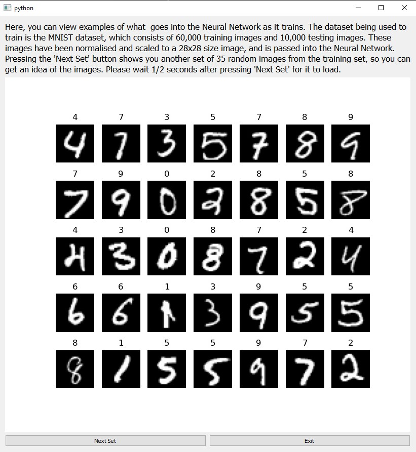
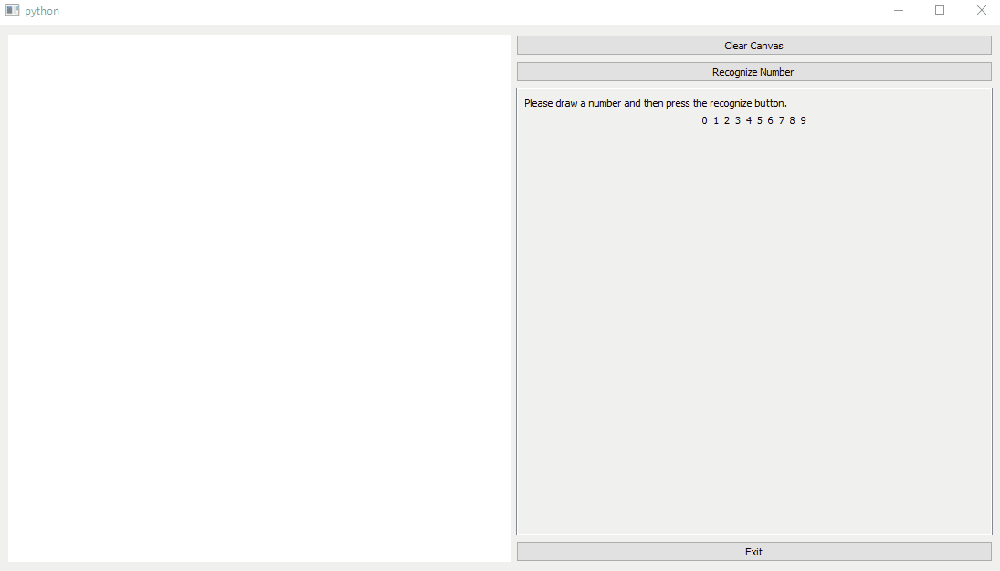

# HandRite, A Python GUI for Handwritten Digit Recognition using Machine Learning


With the prevalence of artificial intelligence in so many aspects of life, the importance of understanding the basics of Neural Networks and machine learning is an important skill to acquire. This software hopes to exemplify one of the most famous use cases of AI, which is in image recognition - particularly user-inputted handwritten digit recognition. It is implemented using the PyTorch library, with PyQt5 being used for GUI design. Two models are used, with the primary model (convolutional neural network) achieving a testing accuracy of 99.2% on the MNIST dataset. See below for examples of the interface at work.

## Usage

Simply run main.py inside the scripts folder to access the interface. The screenshots below show some of the key functionalities.

Main Window:


Displaying MNIST Examples:


Drawing Canvas and Prediction:


## Getting Started

### Prerequisites

* [Pytorch](https://pytorch.org/) - The machine learning library used to implement the model
* [Pyqt5 ](https://pypi.org/project/PyQt5/) - Python GUI implementation
* Other helper libraries also used include: Matplotlib, Numpy, Opencv, Pillow, Scikit-image, Torchvision, Pandas

These libraries can be easily installed using conda or pip. For example,
```
conda install pillow
```

### Installing

At the current stage of deployment, all that is required is to create a copy of the folder (download from Github) and run main.py. The interface will open if all the prerequisites are met, and the software will be ready to use.

## Authors

* **Paulse Anithottam** 
* **Sidharth Varma** 

Feel free to reach out to our GitHub accounts if you have any suggestions/ ideas for improvements. We hope to further improve the implementation where possible.
